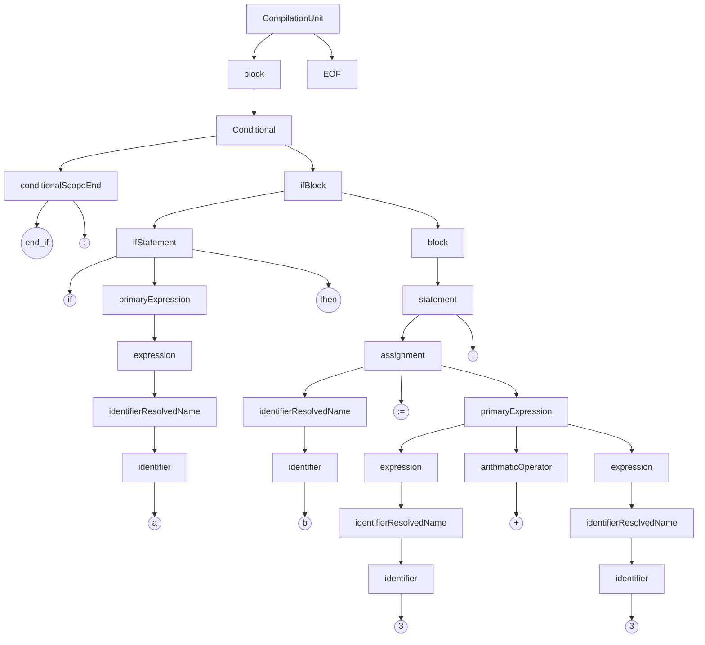
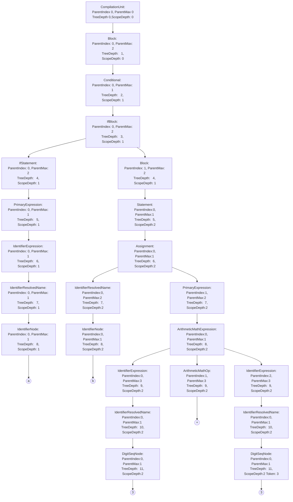

# StCompilerLib 

This is the very early start to a framework for the AllenBradley ST -> Ladder logic compiler. 
As of this writing the overall grammar has been roughed out (though could be improved dramatically) and the generic tree constructs have been written. As well as the initial tree rewrite into the first custom tree. (More info on that later)

### The AntlrTree
[Antlr]([https://github.com/antlr/antlr4](https://github.com/antlr/antlr4)): Has been chosen as the tool for lexing and subsequent parsing into a
 Concrete Syntax Tree ( known from now on as the **AntlrTree**). 
This is an example of the generated **AntlrTree** for the following example ST code: 
```vbnet
   if  a  then
	   b  :=  3 + 3;
   end_if;
```

The **AntlrTree** is a 1:1 representation of the grammatical structure of a given ST file. All keywords and tokens in the given ST file can be found within it. It is generated using the [Antlr C# Runtime]([https://github.com/tunnelvisionlabs/antlr4cs](https://github.com/tunnelvisionlabs/antlr4cs)) written by Sam Harwell and the **AllenBradleyST.g4** grammar file found in the *STCompilerLib* project. This tree is then converted to a **MetaTree** using the visitor pattern.
### The MetaTree
The Next step is the compilation process is converting the **AntlrTree** into what I call a **MetaTree**. The **MetaTree** is very similar in form to the **AntlrTree**. Its key differences being:
1. The extraneous Nodes/Tokens have been stripped away E.G "if", "then", scope end, etc.
2.  Generic Node types have been replaced with more contextually accurate Nodes
3. As of this writing the following "Meta" information has been added with multiple tree traversals
 A. ParentMax: The Number of children the Nodes parent possessed
 B. ParentIndex: The index of the current Node in its parents List< T > of nodes
 C. TreeDepth: The depth of the current node from the top of the tree
 D. ScopeDepth: The level of scope within the ST file that that node resides in e.g
 ```vbnet
 'ScopeDepth 0
 if a then
	'ScopeDepth 1
	b := 3;
	if b = 3 then
		  'ScopeDepth 2
		  c := 4;
	end_if;
end_if;
```
Following from the previous example given at the beginning for the **AntlrTree** this is the **MetaTree** created from the above **AntlrTree**



As you can see contexual information has been added and nodes that where not needed have been disposed of. As well as generic nodes types have been replaced with more specific node types.

# Whats Next?
The next step in this process will be to traverse the tree and generate the temporary bits required for ladder nesting to work. We have to play around the ladder restriction that only allows up to 6 levels of nesting. We must generate temp flow bits and drop back in scope to get around this. The next tree type will have those bits included as well as saved for later when we emit the L5K file.
